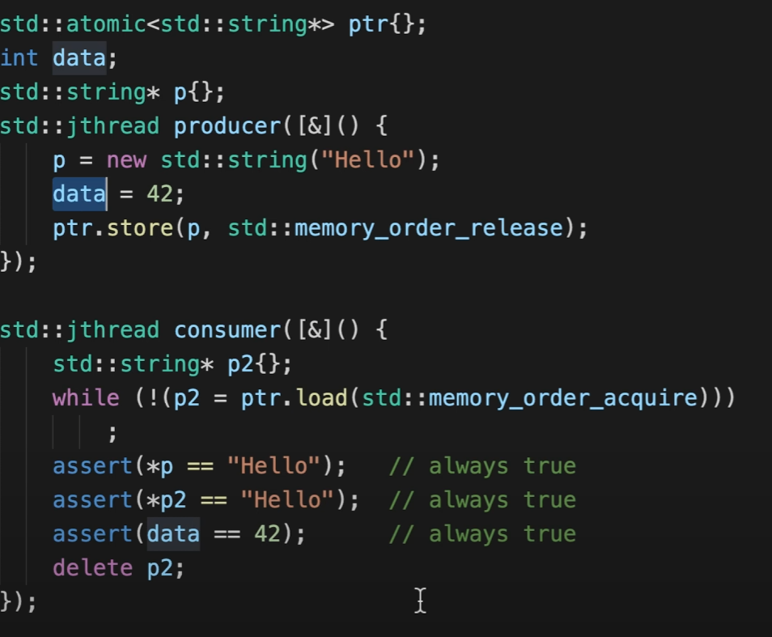
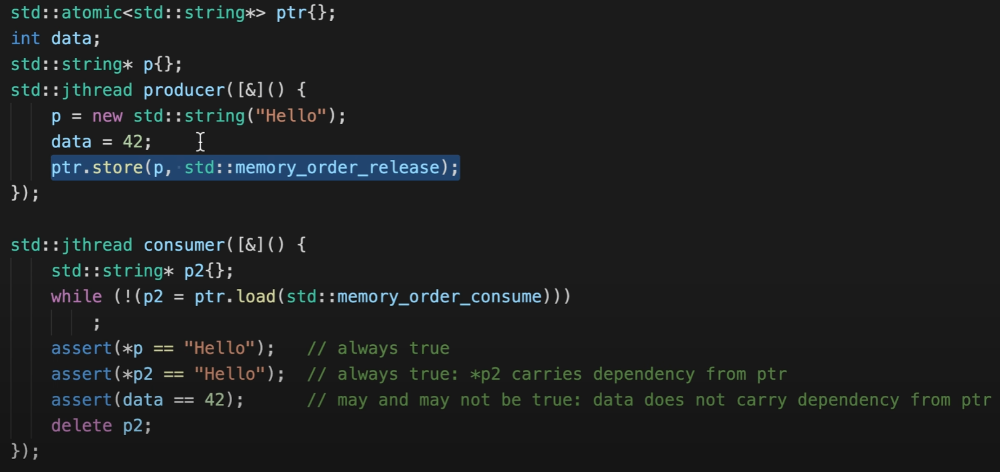



## Memory Layout

### Code (Text) Segment

Store executable instructions. i.e., functions and member functions.

### Data Segment 

Global and static variables.

### Stack

Temporary variables.

### Heap

Dynamic memory allocation. Notice that **member variables could be both in stack or heap**. It depends on how the object is instantiated.

## Miscellaneous
|  |  |  |
| -------- | ------- | ------- |
| <a href="#const_cast" target="_self"><code>const_cast</code></a> | [CPP Reference](https://en.cppreference.com/w/cpp/language/const_cast) |  |
| <a href="#distance" target="_self"><code>std::distance</code></a> | [CPP Reference](https://en.cppreference.com/w/cpp/iterator/distance) | [CPlusPlus.com](https://cplusplus.com/reference/iterator/distance/) |
| <a href="#remove_reference" target="_self"><code>std::remove_reference</code></a> | [CPP Reference](https://en.cppreference.com/w/cpp/types/remove_reference) | [CPlusPlus.com](https://cplusplus.com/reference/type_traits/remove_reference) |
| <a href="#forward" target="_self"><code>std::forward</code></a> | [CPP Reference](https://en.cppreference.com/w/cpp/types/forward) | [CPlusPlus.com](https://cplusplus.com/reference/type_traits/forward) |

- Why we need placement new?
  - Because memory allocation require calling the kernel. Calling the kernel all the time is bad in terms of performance.
- C++ uses "name mangling to implement overload. That's why when using a C library, the functions defined in the header needs `extern "C" {}` to disable  name mangling.
- About intialize list: a class's member variables will initialize before the constructor is excuted unless you write initializer list in the constructor. Also notice that **the order the member variables initialize is not influenced by the order you write the initializer list**.

- In a class definition, do not write initializer for static members, unless `static constexpr`.

- The static variables defined inside a template function and class may react not as expected:
  ```cpp
  template<typename T> void foo(const T& x) {
    static int v=1; cout << v++ << endl;
  }
  int main() {
    foo(1); foo(1.1); // 1 1
  }
  ```

- If global variable is to be used across multiple .c files, you should not declare it static. Instead you should declare it `extern` in header file included by all .c files that need it. `static` is within the compilation unit so every .cpp files that include the header file has its own version of this variable.
  - In header file, write `extern int GlobalState;` and in one cpp file, write `int GlobalState = 1;`.
  - Or alternatively:
  ```cpp
  // static int a = 1; // don't
  int GetA() {
    static int a = 1;
    return a;
  }
  ```
- The size of an empty class/struct is 1 byte.
  - The two different objects will have different addresses.
- Meyer's Singleton
  ```cpp
  class Singleton {
    public:
      static Singleton& Instance() {
        static Singleton instance;
        return instance;
      }
      Singleton(const Singleton&) = delete;
      Singleton(Singleton&&) = delete;
      Singleton& operator=(const Singleton&) = delete;
      Singleton& operator=(Singleton&&) = delete;
    private:
      Singleton() = default;
      ~Singleton() = default;
  };
  ```
- Can I instantiate a abstract class?
  - Only if you implemented the pure virutal functions in the abstract class. A function decorated with `=0` can have definition.
  - `=0` asks all the children override this function.
- How to call base method with a pointer/reference to the child object: `child->base::foo()`
- When using `reinterpret_cast` for non-pointer/reference: `unsigned int j = 0xffffffffu; int jj = reinterpret_cast<int&>(j);`.

<a name="distance"></a>
- `distance(first, second)` returns the number of increments for `first` to get to `second`. For example, `distance(container.begin(), container.end())` returns the contianer's size.

<a name="const_cast"></a>
- `const_cast` allows you to modify a constant pointer or reference. Noticed that it won't work for constant variables.
  ```cpp
  int i = 3;
  const int& rci = i;
  const_cast<int&>(rci) = 4;

  const int i = 5;
  const int* p = &i;
  *const_cast<int*>(p) = 6; // won't work
  ```
  You can use `const_cast` to implement `T const& operator[](const size_t&) const` with `T& operator[](const size_t&)`:
  ```cpp
  T const& operator[] (const size_t& idx) const {
    return const_cast<T&>(*this)[idx];
  }
  ```

- add two numbers using bitwise operationrs:
    ```cpp
    while(y) {
      // Carry now contains common set bits of x and y
      carry = x & y ;
      // Sum of bits of x and y where at least one of the bits is not set
      x = x ^ y; 
      // Carry is shifted by one so that adding it to x gives the required sum
      y = carry << 1; }
    return x;
    ```
- ```cpp
  bool isPowerOfTwo(int n) {
    return (n & (n - 1)) == 0;
  }
  ```
- ```cpp
  bool swap(int& a, int& b) {
    a = a ^ b;
    b = a ^ b;
    a = a ^ b;
  }
  ```


<a name="remove_reference"></a>
- `std::remove_reference`: make sure the parameter is value, not reference.
  ```cpp
  template<typename T>
  void foo(typename remove_reference<T>::type param) {}
  ```
  Add the implementation of `std::move` needs it:
  ```cpp
  template<typename T>
  typename std::remove_reference<T>::type&& move(T&& t) {
    return static_cast<typename std::remove_reference<T>::type&&>(t);
  }
  ```
  Sample implementation:
  ```cpp
  template <class T>
  struct remove_reference {
    typedef T type;
  };
  template <class T>
  struct remove_reference<T&> {
    typedef T type;
  };
  template <class T>
  struct remove_reference<T&&> {
    typedef T type;
  };
  ```

<a name="forward"></a>
- `std::forward`: Perfect forwarding is there to ensure that the argument provided to a function is forwarded to another function (or used within the function) with the same value category (basically r-value vs. l-value) as originally provided.
  
  **Use it when forwarding parameters to another funcion inside a funtion that has universal reference** because **rvalue reference is lvalue**.

  Sample Implementation (think about Reference Collapsing):
  ```cpp
  template <typename T>
  T&& forward(typename std::remove_reference<T>::type& param) {
    return static_cast<T&&>(param);
  }
  template <typename T>
  T&& forward(typename std::remove_reference<T>::type&& param) {
    return static_cast<T&&>(param);
  }
  ```

- Nested template example:
  ```cpp
  template<template<typename, typename> class Container, typename T, typename TT>
  void foo(Container<T, TT>& p) {
    std::cout << typeid(T).name() << " " << typeid(TT).name() << "\n";
  }
  ```

- Force using array as parameter. Pointer not allowed:
  ```cpp
  template<size_t N>
  size_t getCStrLength(const char(&str)[N]) {
    return N;
  }
  ```

- ```cpp
  int i = 0xffffffff;
  unsigned int u = 0xffffffff;
  cout << i << "\n";          // -1
  cout << u << "\n";          // 4294967295
  cout << 0xffffffff << "\n"; // 4294967295
  ```

- Overloading `+`:
  ```cpp
  foo foo::operator+ (const foo& c) const
  {
    foo result;
    // ...
    return result;
  }
  ```

- Overloading `+=`:
  ```cpp
  foo& foo::operator+= (const foo& c)
  {
    //...
    return *this;
  }
  ```

- Overloading `<<` and `>>`:
  ```cpp
  std::ostream& operator<<(std::ostream& os, const T& obj)
  {
      // write obj to stream
      return os;
  }
  std::istream& operator>>(std::istream& is, T& obj)
  {
      // read obj from stream
      if (/* T could not be constructed */)
          is.setstate(std::ios::failbit);
      return is;
  }
  ```

## Substitution failure is not an error

TODO

## Multithreading

- `std::thread` can run a function on a new thread.
  ```cpp
  #include <thread>
  void foo() {}
  int main() {
    std::thread worker(foo);
    // do other things...
    worker.join(); // wait for it to complete
  }
  ```
- Call `join()` / `detach()` two times will crash the program.
- Call `thread`'s destructor before `join()` or `detach()` will crash the program.
- When `main()` returns, all the detached threads will be suspended by the OS.
- Use `std::scoped_lock` (C++ 17) or `std::lock_guard` (C++ 11) to lock a `std::mutex` so that you don't need to release the lock manually.
- Use `std::atomic<T>`:
  ```cpp
  std::atomic<bool> ready (false);
  void foo() {
    while (!ready) std::this_thread::yield(); // use yiled when waiting
    // do something
  }
  ```
- `compare_exchange_weak` vs. `compare_exchange_strong`: `compare_exchange_weak` may not exchange the desired value and return `false` even if the comparing value equals to the memory. `compare_exchange_strong` will guarentee the successfulness.
- Use compare and swap to implement atomic increment (CAS return old value):
  ```cpp
  T old = *address, assume;
  do {
    assume = old;
    old = CAS(address, old, old+1);
  } while (old != assume);
  ```
- Use compare and swap to implement mutex:
  ```cpp
  int lock = 0;
  // ...
  while (CAS(&lock, 0, 1) == 1) // try to lock it
    continue;
  // ...
  lock = 0;
  ```

### Atomic vs. Mutex

TODO

## Memory Barrier

```cpp
int x = 0, y = 0;
// thread 1
x = 1;
r1 = y;
cout << r1 << "\n";
// thread 2
y = 1;
r2 = x;
cout << r2 << "\n";
```

The results might **all** be zero because the optimization of the compiler, or different CPU core having different caches. To synchronize the order of memory RW, we can use mutex. We can also use memory barriers (faster than mutex). 

Memory barriers will guarantee that the order of RW memories will be the same as the order of the source codes. E.g., thread 1 may execute `r1 = y` before `x = 1` because the optimization by the compiler. Using memory barriers can force the execution order.

```cpp
int x = 0, y = 0;
// thread 1
x = 1;
STORELOAD_FENCE();
r1 = y;
cout << r1 << "\n";
// thread 2
y = 1;
STORELOAD_FENCE();
r2 = x;
cout << r2 << "\n";
```

In this case the results might be `1 1`, `0 1`, `1 0` but never `0 0`!


- Basic types:
  - Load-Load

    The loads before the barrier will happen before the loads after the barrier.

  - Store-Store
    
    The stores before the barrier will happen before the stores after the barrier. Think of `git push`.

  - Load-Store

  - Store-Load

- Acquire: Load-Load + Load-Store
  - Every memory R/W after Acquire stays after Acquire.
  
    

- Release: Load-Store + Store-Store
  - Every memory R/W before Release stays before Release.

    

## Memory Order

### Sequence Consistent (strictest)

```cpp
std::atomic<bool> x { false };
// in thread, write
x.store(true, std::memory_order_deq_cst);
// in thread, read
bool y = x.load(std::memory_order_deq_cst);
```

**Sequence Consistent** guarantees the memory RW order is the same as source codes (memory barriers). 

It also guarantees if at a certain time t, a thread R/W the atomic variable, all the threads after t will see the results after this R/W. E.g., if thread 1 writes the variable with 1 at time t, then all the threads at t+1 loading the variable will get 1. (think of how it might not be 1 on a multi core CPU)

### Relaxed (least strict)

`std::memory_order_relaxed`. Used in `shared_ptr`

**Relaxed** guarantees the R/W is atomic. It doesn't guarantee the order of executions of R/W is the same as the source codes. (no memory barriers)

### Acquire & Release

See Memory Barriers.

```std::memory_order_release```

```std::memory_order_release```

All the memory R/W before Release will be seen by Acquire.



### Consume

```std::memory_order_consume```.

Consume is weaker than Acquire. It won't carry dependancies from memories that not related to Release.



## Memory

- Packing (padding is the size of struct's largest element): 
  ```cpp
  struct A { // size 16
    int a;
    double e;
  };
  struct B { // size 12
    char a; char b; char c;
    int d;
    char e;
  };
  struct C { // size 24.
    // padding is not sizeof(A) but still sizeof(int). nested structures doesn't change padding
    // but sizeof(aa) is still A's size.
    int a;  // 8
    A aa;   // 16
  };
  struct D { // size 24.
    // padding is not sizeof(A) but still sizeof(int). nested structures doesn't change padding
    // but sizeof(aa) is still A's size.
    int a; // 8
    A aa;  // 16
    int b; //8
  };
  ```
  To disable packing, `#pragma pack(1)`. Without packing, CPU deoes more readings.
- Impact of VPtr:
  ```cpp
  class A { // size 1
    char a;
  }
  class B { // size 16
    char a;
    virtual void foo() {}
  }
  ```

|  |  |  |
| -------- | ------- | ------- |
| <a href="#realloc" target="_self"><code>realloc</code></a> | [CPP Reference](https://en.cppreference.com/w/c/memory/realloc) | [CPlusPlus.com](https://cplusplus.com/reference/cstdlib/realloc/) |
| <a href="#calloc" target="_self"><code>calloc</code></a> | [CPP Reference](https://en.cppreference.com/w/c/memory/calloc) | [CPlusPlus.com](https://cplusplus.com/reference/cstdlib/calloc/) |
| <a href="#allocator" target="_self"><code>std::allocator</code></a> | [CPP Reference](https://en.cppreference.com/w/cpp/memory/allocator) | [CPlusPlus.com](https://cplusplus.com/reference/memory/allocator/) |

<a name="realloc"></a>
- `realloc` tries to expand or compress the **exisiting** memories. If there is not enough memory, the old memory block is not freed and null pointer is returned.
<a name="calloc"></a>
- `calloc` takes two arguments and initializes the allocated memory block to zero: `int *arr = (int*)calloc(n, sizeof(int));`
  - `calloc` is slower than `malloc` cause it will initialize the memory to 0.
- **Placement new**: Explicitly create objects on a specifized memory block. `char* buffer = new char[sizeof(MyClass)]; MyClass* obj = new (buffer) MyClass();`<br>Object Pooling can be achieved with placement new.
<a name="allocator"></a>
- `allocator` is a wrapper for `malloc` and `free`.
  ```cpp
  MyClass* buffer = std::allocator.allocate(5);
  for (int i = 0; i < 5; ++i) {
    allocator.construct(&buffer[i], MyClass());
  }
  for (int i = 0; i < 5; ++i) {
    allocator.destroy(&buffer[i]);
  }
  allocator.deallocate(buffer, 5);
  ```

## STL

|  |  |  |
| -------- | ------- | ------- |
| <a href="#reduce" target="_self"><code>std::reduce</code></a> | [CPP Reference](https://en.cppreference.com/w/cpp/algorithm/reduce) |  |
| <a href="#max_element" target="_self"><code>std::max_element</code></a> | [CPP Reference](https://en.cppreference.com/w/cpp/algorithm/max_element) | [CPlusPlus.com](https://cplusplus.com/reference/algorithm/max_element/) |
| <a href="#upper_bound" target="_self"><code>std::upper_bound</code></a> | [CPP Reference](https://en.cppreference.com/w/cpp/algorithm/upper_bound) | [CPlusPlus.com](https://cplusplus.com/reference/algorithm/upper_bound/) |
| <a href="#lower_bound" target="_self"><code>std::lower_bound</code></a> | [CPP Reference](https://en.cppreference.com/w/cpp/algorithm/lower_bound) | [CPlusPlus.com](https://cplusplus.com/reference/algorithm/lower_bound/) |
| <a href="#equal_range" target="_self"><code>std::equal_range</code></a> | [CPP Reference](https://en.cppreference.com/w/cpp/algorithm/equal_range) | [CPlusPlus.com](https://cplusplus.com/reference/algorithm/equal_range/) |
| <a href="#reverse" target="_self"><code>std::reverse</code></a> | [CPP Reference](https://en.cppreference.com/w/cpp/algorithm/reverse) | [CPlusPlus.com](https://cplusplus.com/reference/algorithm/reverse/) |
| <a href="#partition" target="_self"><code>std::partition</code></a> | [CPP Reference](https://en.cppreference.com/w/cpp/algorithm/partition) | [CPlusPlus.com](https://cplusplus.com/reference/algorithm/partition/) |
| <a href="#make_heap" target="_self"><code>std::make_heap</code></a> | [CPP Reference](https://en.cppreference.com/w/cpp/algorithm/make_heap) | [CPlusPlus.com](https://cplusplus.com/reference/algorithm/make_heap/) |
| <a href="#pop_heap" target="_self"><code>std::pop_heap</code></a> | [CPP Reference](https://en.cppreference.com/w/cpp/algorithm/pop_heap) | [CPlusPlus.com](https://cplusplus.com/reference/algorithm/pop_heap/) |
| <a href="#push_heap" target="_self"><code>std::push_heap</code></a> | [CPP Reference](https://en.cppreference.com/w/cpp/algorithm/push_heap) | [CPlusPlus.com](https://cplusplus.com/reference/algorithm/push_heap/) |

<a name="reduce"></a>
- To sum: `reduce(container.begin(), container.end)`.
  - Python equivalent: `sum(container)`.
- Customize the reduction operator: `auto multiply = [](int x, int y) { return x * y; }; int product = reduce(container.begin(), container.end(), 1, multiply);`
  - Python equivalent: `functools.reduce(lambda a, b: a*b, container, 1)`
<a name="max_element"></a>
- Find the maximum element: `max_element(container.begin(), container.end)`
  - Python equivalent: `max(container)`
<a name="upper_bound"></a>
<a name="lower_bound"></a>
<a name="equal_range"></a>
- Binary search: [`lower_bound`](https://en.cppreference.com/w/cpp/algorithm/lower_bound), [`upper_bound`](https://en.cppreference.com/w/cpp/algorithm/upper_bound) or [`equal_range`](https://en.cppreference.com/w/cpp/algorithm/equal_range). The container must be sorted. <br>`lower_bound` and `upper_bound` return the iterator. `equal_range` returns a pair of iterators. <br>`lower_bound` returns the first element that **not less** than the query and `upper_bound` returns the first element that **greater** than the query.
  - Python equivalent: `lower_bound = bisect.bisect_left(container, x); upper_bound = bisect.bisect_right(container, x)`
  - `equal_range` equivalent: `[i for i in container if x >= a && x <= b]`
<a name="reverse"></a>
- To reverse: `reverse(container.begin(), container.end())`.
  - Python equivalent: `container[::-1]`
<a name="partition"></a>
- `partition(firstIt, secondIt, unaryPredicate)` can divide the container into two groupds: those for which the predicate returns true and those for which it returns false. It returns the iterator to the first element of the second group. An good example of `partition` is Quick Sort.
  -  Python equivalent: there isn't one.
<a name="make_heap"></a>
- `make_heap(container.begin(), container.end())`. Directly constructs a heap. The first element is the top.
<a name="push_heap"></a>
- `push_heap(container.begin(), container.end())`. Only effective when the container is already a heap except for its last element. You want to insert a new element into the tail of the container and call `push_heap`.
<a name="pop_heap"></a>
- `pop_heap(container.begin(), container.end())`. Only effective when the container is already a heap. The top will be swapped to the last element. `[begin, end)` is still a heap.

## Algorithms

### Prim

```cpp
void prim(vector<vector<ii>> const& adj, int s) {
  priority_queue<ii, vector<ii>, greater<ii>> pq;
  parents.resize(N);
  keys.resize(N, INT_MAX);
  keys[s] = 0;
  pq.emplace(0, s);

  while(!pq.empty()) {
    auto [d, u] = pq.top();
    pq.pop();

    if(d > keys[u])
      continue; //lazy deletion

    for(auto &[v,w]: adj[u]) {  
      if(w < keys[v]) { // note: difference here
        keys[v] = w;
        parents[v] = u;
        pq.emplace(keys[v], v);
      }
    }
  }
}
```

### Quick Sort

```cpp
vector<int> sortArray(vector<int>& nums) {
  quickSort(nums, 0, nums.size()-1);
  return nums;
}
void quickSort(vector<int>& nums, int left, int right)
{
  if (left >= right) return;
  if (left < 0) return;
  if (right >= nums.size()) return;

  int pivot = nums[(left+right) / 2];
  swap(nums[left], nums[(left+right) / 2]);
  int i = left;
  int j = right;
  while (true)
  {
    while (nums[j] >= pivot && j > i) j--;
    if (j == i) break;
    while (nums[i] <= pivot && j > i) i++;
    if (j == i) break;
    swap(nums[i], nums[j]);
  }
  swap(nums[left], nums[i]);
  quickSort(nums, left, i-1);
  quickSort(nums, i+1, right);
}
```

### Quick Select

```cpp
```

