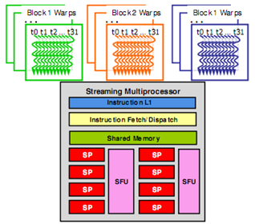
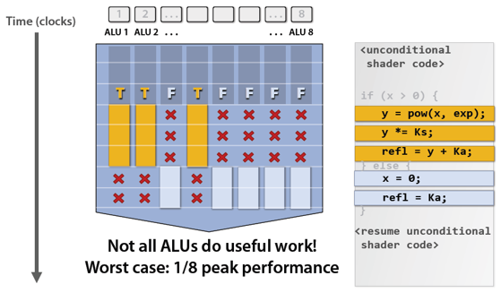
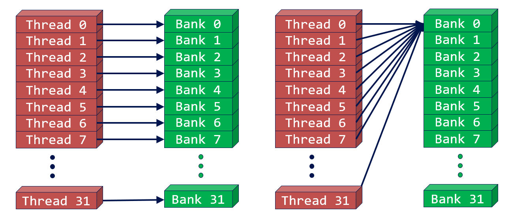
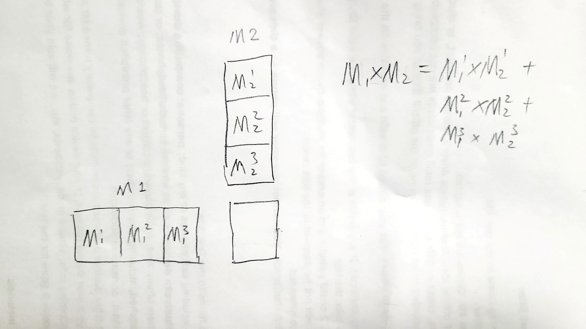
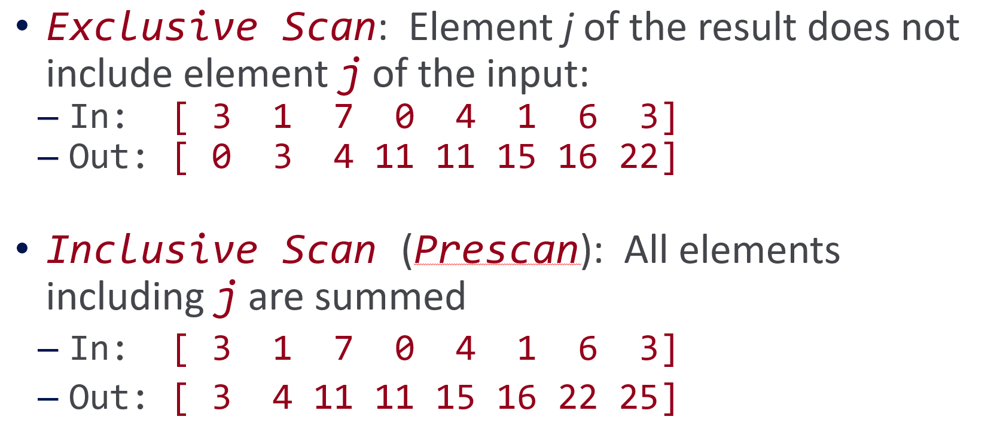
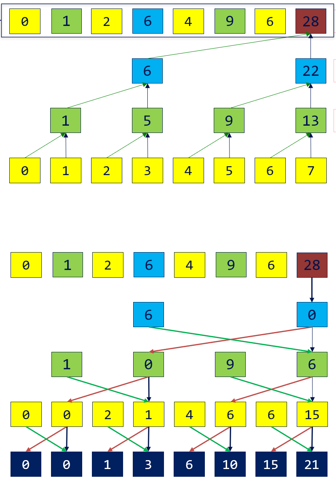
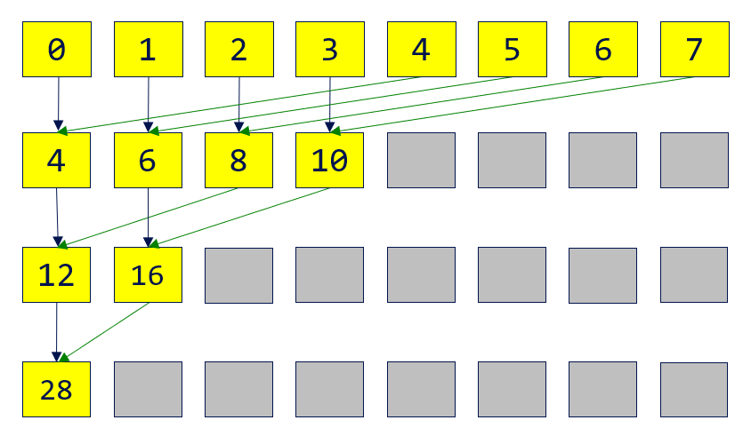



## Architectures 

- 
  - A block can be only excuted by one SM but an SM can excute different blocks.
  - A CUDA core excutes a thread.
- 
   - SM puts cores into warps, and excutes only one warp at any time. The threads in a warp come from the same block and have consecutive indices. Modern GPU has 32 cores per SM so in the optimal situation a warp can finish in one clock: 
  - Therefore, try not to diverge the commands in one warp (e.g., using `if-else` statements). Otherwise:
    
- Although we can configure how many threads a block has, there is a limit to it (typically 1024).
- There is also a limit to how many threads an SM handles but I remember when dispatching a kernel function, only **number of the blocks** and **number of the threads per block** are assigned.

## Memory

- Global, constant, shared, and local.
- Constant memory reading is faster than global memory cause an SM has a constant cache for it.
- Notice that the local memory is actually registers and **global memory**. If an SM runs out of registers, it will use global memory as last resort (called register_spilling). However, it is cached using L1 so it's faster than directly using the global memory.
- Each SM has one L1 and one shared memory. All SM share one L2.
- Always use shared memory when random accessing. Randomly accessing global memory is very slow.
- **Shared Memory can only be used for threads that are in the same block**. 
- Although shared memory is for random accessing, we should avoid multimple threads in one warp trying to access the same shared memory (bank conflict).
  - But it's okay if all the 32 threads access the same shared memory (broadcast):
    
  - An example of avoiding bank conflicts:
    ```cpp
    __shared__ float shared[256];
    float f = shared[tId + s * threadIdx.x]; // when s is odd
    ```


## Synchronization and Atomics

- `__syncthreads()` can synchronize the threads **in the same block**.
- Do not put `__syncthreads()` in the branch! May cause deadlock.
- `int atomicCAS(int* address, int compare, int val)`: If the address's value is the compare value, update the address to new value. Return the **original** value of the address. 
  - Implement the thread lock using `atomicCAS`:
    ```cpp
    int lock = 0;
    while (atomicCAS(&lock, 0, 1) == 1) // try to lock it
      continue；
    ```
- The functions below all return the original value of the address: 
  - `int atomicAdd(int* address, int val)`
  - `int atomicSub(int* address, int val)`
  - `T atomicExch(T* address, T val)`: Change the value of address.
  - `int atomicMax(int* address, int val)`: Change the value of address to `max(*address, val)`. 
  - `int atomicAnd(int* address, int val)`
  - `int atomicOr(int* address, int val)`
  - `int atomicXor(int* address, int val)`

## Matrix Multiplication

### CPU

- On CPU, simply use for-loop to perform matrix multiplication.
  ```cpp
  template<size_t m, size_t n, size_t p>
  void Mul(const int A[m][n], const int B[n][p], int C[m][p])
  {
    for(size_t i=0;i < m; ++i)
    {
      for (size_t j = 0; j < p; ++j)
      {
        for (size_t k = 0; k < n; ++k)
          C[i][j] += A[i][k] * B[k][j];	
      }
    }
  }
  ```

### GPU

- If the matrix size exceeds grid size limit:
  
  break the matrix into multimple sub-matrix whose size is not greater than grid size limit and perform multiple multiplications. Also, we can set the grid and block's dimensions 2D to get better indices.

- We can use shared memory to improve data localization:
  ```cpp
  __global__ void MatMulKernel(const float* devM, const float* devN, float* devP, const int width)
  {
    __shared__ float sM[TILE_WIDTH][TILE_WIDTH];
    __shared__ float sN[TILE_WIDTH][TILE_WIDTH];
    
    int bx = blockIdx.x; 	int by = blockIdx.y;
    int tx = threadIdx.x;	int ty = threadIdx.y;
    
    int col = bx * TILE_WIDTH + tx;
    int row = by * TILE_WIDTH + ty;
    
    // Initialize accumulator to 0
    float pValue = 0;
    
    // Multiply and add
    for (int m = 0; m < width / TILE_WIDTH; m++) {
      sM[ty][tx] = devM[row * width + (m * TILE_WIDTH + tx)];
      sN[ty][tx] = devN[col + (m * TILE_WIDTH + ty) * Width];
      __syncthreads();
    
      for (int k = 0; k < TILE_WIDTH; ++k)
          Pvalue += sM[ty][k] * sN[k][tx];
      __synchthreads(); // don't forget this line. writing shared memories ahead.
    }
    devP[row * width + col] = pValue;
  }
  ```

## Scan





## Reduction



```cpp
__shared__ float partialSum[];
// ... load into shared memory
for (int stride = blockDim.x / 2; stride > 0; stride /= 2) {
  __syncthreads();
  if (tId < stride)
	  partialSum[tId] += partialSum[tId + stride];
}
if (tId == 0) output[bId] = partialSum[0];
```

## Stream Compaction

## Radix Sort

## See also:
- [Thrust](https://thrust.github.io/)
- [CUDA C Programming Guide](https://docs.nvidia.com/cuda/cuda-c-programming-guide)
- [CUDA Runtime API](https://docs.nvidia.com/cuda/cuda-runtime-api/index.html)
- [GPU Gems 3](https://developer.nvidia.com/gpugems/gpugems3/contributors)

