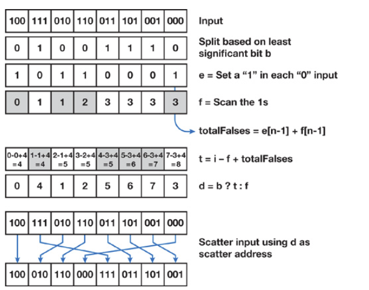



## Architectures 

- 
  - A block can be only excuted by one SM but an SM can excute different blocks.
  - A CUDA core excutes a thread.
- 
   - SM puts cores into warps, and excutes only one warp at any time. The threads in a warp come from the same block and have consecutive indices. Modern GPU has 128 cores per SM so each SM has 4 warp scheduler. 
  - When a block is divided up into warps, each warp is assigned to a warp scheduler. Warps will stay on the assigned scheduler for the lifetime of the warp.
  - Therefore, try not to diverge the commands in one warp (e.g., using `if-else` statements). Otherwise:
    
- Although we can configure how many threads a block has, there is a limit to it (typically 1024).
- There is also a limit to how many threads an SM handles but I remember when dispatching a kernel function, only **number of the blocks** and **number of the threads per block** are assigned.

## Occupancy

Occupancy is the ratio of the number of active warps per multiprocessor to the maximum number of possible active warps. Another way to view occupancy is the percentage of the hardware's ability to process warps that is actively in use. Higher occupancy does not always result in higher performance, however, low occupancy always reduces the ability to hide latencies, resulting in overall performance degradation. Large discrepancies between the theoretical and the achieved occupancy during execution typically indicates highly imbalanced workloads.

    Suppose 4 clock cycles are needed to dispatch the same instruction for all threads in a warp. If there is one global memory access every 4 instructions, how many warps are needed to fully tolerate 200-cycle memory latency?

    The first warp will run for 16 cycles before a memory access is required. After this time this warp needs to wait for 200 cycles. At this time the warp scheduler can switch to another warp and start executing its first 4 instructions. After another 16 cycles this process repeats until the scheduler can switch back to the original warp after 200 cycles.

    So number of warps = ceil(200/16) = 13.


## Memory

- Global, constant, shared, and local.
- Constant memory reading is faster than global memory cause an SM has a constant cache for it.
- Notice that the local memory is actually registers and **global memory**. If an SM runs out of registers, it will use global memory as last resort (called register_spilling). However, it is cached using L1 so it's faster than directly using the global memory.
- Each SM has one L1 and one shared memory. All SM share one L2.
- Always use shared memory when random accessing. Randomly accessing global memory is very slow.
- **Shared Memory can only be used for threads that are in the same block**. 
- Shared memory is divided into memory banks:
  
- Although shared memory is for random accessing, we should avoid different threads(in the same warp) access different addresses in the same bank.
- But it's okay if all the 32 threads access the same shared memory address (broadcast):
  
- An example of avoiding bank conflicts:
  ```cpp
  __shared__ float shared[256];
  float f = shared[tId + s * threadIdx.x]; // when s is odd
  ```
- Bank conflicts are only possible within a warp. No bank conflicts occur between different warps.

Host (CPU) data allocations are pageable by default. Transfering pageable data to device is slow. To maxiumize the bandwidth, use `cudaHostAlloc` or `cudaHostRegister`.

## Stream

- `cudaStream_t`
- `__host__​cudaError_t cudaStreamCreate (cudaStream_t* pStream)`
- `__host__​cudaError_t cudaStreamSynchronize (cudaStream_t stream)`
- `__host__​__device__​cudaError_t 	cudaStreamDestroy(cudaStream_t stream)`

### cudaMemcpyAsync

`__host__​__device__​cudaError_t cudaMemcpyAsync (void* dst, const void* src, size_t count, cudaMemcpyKind kind, cudaStream_t stream = 0)`

`cudaMemcpyAsync` won't stall CPU while `cudaMemcpy` does.

If kind is cudaMemcpyHostToDevice or cudaMemcpyDeviceToHost and the stream is non-zero, **the copy may overlap with operations in other streams**.


```c
for (int i = 0; i < nStreams; ++i) {
  int offset = i * streamSize;
  cudaMemcpyAsync(&d_a[offset], &a[offset], streamBytes,
                  cudaMemcpyHostToDevice, stream[i]);
} for (int i = 0; i < nStreams; ++i) {
  int offset = i * streamSize;
  kernel<<<streamSize/blockSize, blockSize, 0, stream[i]>>>(d_a, offset);
} for (int i = 0; i < nStreams; ++i) {
  int offset = i * streamSize;
  cudaMemcpyAsync(&a[offset], &d_a[offset], streamBytes,
                  cudaMemcpyDeviceToHost, stream[i]);
} 
```


## Event
An event is completed when all commands in the stream preceding it complete.

```c
cudaEvent_t start, stop;
cudaEventCreate(&start);
cudaEventCreate(&stop)
cudaEventRecord(start, stream1);
kernel<<<gridSize, blockSize, sharedMemSize, stream1>>>();
cudaEventRecord(stop, stream1);
cudaEventSynchronize(stop);
float elapsedTime;
cudaEventElapsedTime(&elapsedTime, start, stop);
// cudaEventDestroy(...)
```

`cudaEventSynchronize` stalls CPU. We can make CPU do some extra jobs before calling `cudaEventSynchronize`.

## Synchronization and Atomics

- `__syncthreads()` can synchronize the threads **in the same block**.
- Do not put `__syncthreads()` in the branch! May cause deadlock.
- `int atomicCAS(int* address, int compare, int val)`: If the address's value is the compare value, update the address to new value. Return the **original** value of the address. 
  - Implement the thread lock using `atomicCAS`:
    ```cpp
    int lock = 0;
    while (atomicCAS(&lock, 0, 1) == 1) // try to lock it
      continue;
    ```
- The functions below all return the original value of the address: 
  - `int atomicAdd(int* address, int val)`
  - `int atomicSub(int* address, int val)`
  - `T atomicExch(T* address, T val)`: Change the value of address.
  - `int atomicMax(int* address, int val)`: Change the value of address to `max(*address, val)`. 
  - `int atomicAnd(int* address, int val)`
  - `int atomicOr(int* address, int val)`
  - `int atomicXor(int* address, int val)`

### warp-level functions
- `int __all (int prediction)`
  - Result is non-zero if all threads in the warp evaluate prediction != 0
- `int __any (int prediction)`
- `unsigned int __ballot (int prediction)`
  - Result is an unsigned int where

    Nth thread of the warp sets the Nth bit of the result

    Bit is set to 1 if and only if predicate != 0
- Shuffle
  - Indexed: `T __shfl(T var, int srcLane, int width=warpSize)`
  - Up: `T __shfl_up(T var, unsigned int delta, int width=warpSize)`. Reads from thread whose idx is less then current's.
  - Down: `T __shfl_down(T var, unsigned int delta, int width=warpSize)`
  - Butterfly (XOR): Copy from lane based on bitwise xor of own lane id.

    Like exchange, doesn’t have to be 2 way

    `laneMask` controls which bits of `laneId` are “flipped”.

    `T __shfl_xor(T var, unsigned int laneMask, int width=warpSize)`
  - We can use Shuffle to perform reduce warp wise.

      ```c
      // warp reduce
      sum += __shfl_xor(sum, 16);
      sum += __shfl_xor(sum, 8);
      sum += __shfl_xor(sum, 4);
      sum += __shfl_xor(sum, 2);
      sum += __shfl_xor(sum, 1);
      // in kernel
      val = warpReduceSum(val);
      if (lane == 0) shared[wid]=val;
      __syncthreads();
      ```


## Matrix Multiplication

### CPU

- On CPU, simply use for-loop to perform matrix multiplication.
  ```cpp
  template<size_t m, size_t n, size_t p>
  void Mul(const int A[m][n], const int B[n][p], int C[m][p])
  {
    for(size_t i=0;i < m; ++i)
    {
      for (size_t j = 0; j < p; ++j)
      {
        for (size_t k = 0; k < n; ++k)
          C[i][j] += A[i][k] * B[k][j];	
      }
    }
  }
  ```

### GPU

- If the matrix size exceeds grid size limit:
  
  break the matrix into multimple sub-matrix whose size is not greater than grid size limit and perform multiple multiplications. Also, we can set the grid and block's dimensions 2D to get better indices.

- We can use shared memory to improve data localization:
  ```cpp
  __global__ void MatMulKernel(const float* devM, const float* devN, float* devP, const int width)
  {
    __shared__ float sM[TILE_WIDTH][TILE_WIDTH];
    __shared__ float sN[TILE_WIDTH][TILE_WIDTH];
    
    int bx = blockIdx.x; 	int by = blockIdx.y;
    int tx = threadIdx.x;	int ty = threadIdx.y;
    
    int col = bx * TILE_WIDTH + tx;
    int row = by * TILE_WIDTH + ty;
    
    // Initialize accumulator to 0
    float pValue = 0;
    
    // Multiply and add
    for (int m = 0; m < width / TILE_WIDTH; m++) {
      sM[ty][tx] = devM[row * width + (m * TILE_WIDTH + tx)];
      sN[ty][tx] = devN[col + (m * TILE_WIDTH + ty) * Width];
      __syncthreads();
    
      for (int k = 0; k < TILE_WIDTH; ++k)
        Pvalue += sM[ty][k] * sN[k][tx];
      __synchthreads(); // don't forget this line. writing shared memories ahead.
    }
    devP[row * width + col] = pValue;
  }
  ```
- Use data prefetching:
  ```cpp
  // ...
  float m = devM[row * width + tx];
  float n = devM[col + ty * with];
  for (int m = 1; m <= width / TILE_WIDTH; m++) {
    sM[ty][tx] = m
    sN[ty][tx] = n
    __syncthreads();

    float m = devM[row * width + tx];
    float n = devM[col + ty * with];
    for (int k = 0; k < TILE_WIDTH; ++k)
      Pvalue += sM[ty][k] * sN[k][tx];
    __syncthreads();
  }
  ```

## Matrix Transpose

### Naive Way

Reading has good memory coalescing. Writing has many cache misses.


### Improvement

Inside the kernel, cache the output into shared memory before writing into the global memory.


## Scan

Up sweep is the same as parallel reduction.


When downsweep, the stride decrements after each step (oppsite to the parallel reduction). In each step, copy the value on the right and write to the left. Sum the both values and write to the right.


## Reduction


```cpp
__shared__ float partialSum[];
// ... load into shared memory
for (int stride = blockDim.x / 2; stride > 0; stride /= 2) {
  __syncthreads();
  if (tId < stride)
	  partialSum[tId] += partialSum[tId + stride];
}
if (tId == 0) output[bId] = partialSum[0];
```

## Stream Compaction

1. Create a mask array.
2. Do exclusive scan on the mask array.
    
3. The exclusive scan result is the indices of the stream compaction result.

## Radix Sort

Perform stream compaction for each radix:



## See also:
- [Thrust](https://thrust.github.io/)
- [CUDA C Programming Guide](https://docs.nvidia.com/cuda/cuda-c-programming-guide)
- [CUDA Runtime API](https://docs.nvidia.com/cuda/cuda-runtime-api/index.html)
- [GPU Gems 3](https://developer.nvidia.com/gpugems/gpugems3/contributors)

