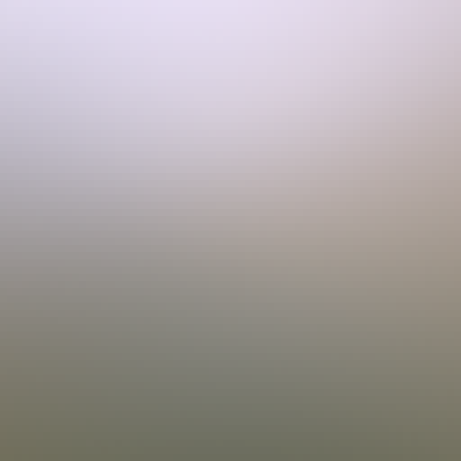
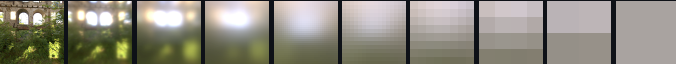



## Miscellaneous

- To solve "Peter-Panning", we can cull front face when rendering the shadowmap.

## Quaternion

, where  is angle,  is axis.

Denote  by ,  by :


To rotate a vector  by quaternion : 


## Pipeline


## Photometry


## Percentage-Closer Filtering (PCF)

When sampling shadowmapping, sample multiple times using the nearby positions around the shading point (noticing this is not filtering).

## Percentage Closer Soft Shadows (PCSS)

When using PCF, sample multiple pixels on the shadowmap, calculate the average distance between the shading point and the object that blocks the light source. Use this distance to determine the size of PCF.

## Barycentric coordinates


*  is the center of mass of a triangle . Then we can represent any coplanar point as  where .
* .
* A barycentric coordinate equals to the area the point forms with the edge it opposes divides by the area of the triangle.
  * , , .
* If none of the coordinates is negative, than the point is inside the triangle.
* Notice that when interpolating using barycentric coordinates in the screen space, we must consider the impact of depth values.
  * , , .

## Spherical Harmonics


Spherical Harmonics are a set of 2D basis functions  defined on the **sphere**.

The functions on a sphere can be projected into Spherical Harmonics: , where  is the coefficent and  is the SH.

Higher the degree of SH, higher the frequncy of the information it can encode.

A rotation R about the origin that sends the unit vector r to r'. Under this operation, a spherical harmonic of degree l and order m transforms into a linear combination of spherical harmonics of the same degree.

The integral of the multiplication of two functions is the dot production of the two corresponding SH coefficients.

### Precompute Radiance Transfer (PRT)

For static scenes, we can project the BRDF, the Visibility, and Lambertian to SH. Since Lighting can also be projected to SH, we can render this scene in **different lighting conditions** in real-time (solve the Rendering Equation with a simple dot production).

Notice the light are allowed to rotate due to the rotational behavior of the spherical harmonics (see above).

For glossy material, the BRDF also need to be projected to SH. In this case, the number of coefficents needed for the scene is squared (a matrix). Then the shading is a vector-matrix multiplication instead of a dot production.

## MSAA


After enabling MSAA N, the cost for frament shading remains unchanged; the cost for rasterizaion is N times more; the size of fragement buffer, depth buffer and stencil buffer is N times more.

When creating the frame buffers, graphics API needs to know wether MSAA is enabled or not. E.g., Vulkan's [`VkImageCreateInfo`](https://registry.khronos.org/vulkan/specs/1.3-extensions/man/html/VkImageCreateInfo.html) requires a [`VkSampleCountFlagBits`](https://registry.khronos.org/vulkan/specs/1.3-extensions/man/html/VkSampleCountFlagBits.html) bit.

Is MSAA compatible with Early-Z Testing? (my assumption: after enable MSAA the cost for fragment shading with Early-Z testing will increase)

## Normal Map


* The values stored in the normal map are in the tangent space, between 0 and 1. It uses two channels for bitangent value and tangent values (the normal value can be retrieved based on the way how we do normalization):
  * ```cpp
    float3 e1 = v1 - v0;
    float3 e2 = v2 - v0;
    float3 dUV1 = uv1 - uv0;
    float3 dUV2 = uv2 - uv0;
    float f = 1.0f / (dUV1.x * dUV2.y - dUV2.x * dUV1.y);
    float3 t = (e1 * dUV2.y - e2 * dUV1.y) * f;
    float3 b = (e2 * dUV1.x - e1 * dUV2.x) * f;
    float3 n = normalize(cross(t, b));
    ```
* When shading, the tangent and bitangent vectors are calculated from the UV coordinates (the tangent aligns with the texture's x-axis and the bitangent aligns with the texture's y-axis). The normal vector retrieved by cross producting the tangent and bitangent. 
* With tangent, bitangent, and normal vectors, we can construct a TBN matrix. Then read the normal values from the normal map. Then we can use the TBN matrix to transform it into world space.
* Notice that the normal map texture must be in linear space.

## Cook-Torrance BRDF


where  is Normal Distrubution Function,  is Fresnel Term, and  is Geometry Term.

### Blending

- Metallic Workflow:
- Specular Workflow: TODO

### Diffuse Term

- Lambertian: 
- Oren-Nayar: TODO

### Normal Distribution Function

Describe the smoothness of the surface. The smoother the surface is, the more the lobe concentrates on the reflection direction.

- GGX: 
  -  is roughness.
  -  is .
- Beckman: 

### Geometry Term

Describe the impact of self occlusion and shadowing.

- Schlick-GGX: TODO

### Fresnel Term

Describe the metallic of the material. The closer to the metal, the more the lobe conentratese on the gazing angle.

- Schlick: 
  -  is the reflection coefficient.
- Fresnel Equation: TODO

## Bidirectional Path Tracing and MIS

Not only do path tracing from the eye, but also from the light source. One drawback of this is it actually doubles the noises since in some region sampling the eye does a good job while in some region sampling the light source does a good job. Simply adding them would introduce both noises.

Using Multiple Importance Sampling can solve this issue. In MIS when a ray intersects with the surface, we not only importance-sample the BRDF and generated a new ray, but also directly sample the light source and generated a ray towards the light source.

MIS can effectively combine results from the importance sampling:


 and  are the two samples we generated by sampling BRDF and direct light sampling in this iteration.  and  are special weighting functions chosen such that the expected value of this estimator.

A recomandation for weighting is power heuristic:


## Russian Roulette

Path tracing cannot go on forever. We could either set a maximum bounce number, or use Russian Roulette to terminate it:

```
P_RR = 0.6
sample(pos, wo):
  ksi = uniform_sample(0, 1)
  if (ksi > P_RR) return 0
  Li = ray_tracing(pos, wo)
  return Li / P_RR
```

## BTDF

TODO

## Summed Area Table (SAT)


Used for approximating depth of field or glossy reflection.

We can do one inclusive scan for row and one inclusive scan for column to get SAT.

## Image Based Lighting (IBL)

Based on Cook-Torrance, use  to approximate .

Apparently the diffuse term is . We can pre-bake the irridiance map:



To querry the map, sample along the reflection angle.

Then, use  to approximate the specular term ( is 1).

Pre-baked radiance mipmap:


  - Left: 0 roughness
  - Right: 1 roughness

Pre-baked BRDF LUT:


[Codes](https://github.com/SaschaWillems/Vulkan-glTF-PBR):

```c
vec3 getIBLContribution(PBRInfo pbrInputs, vec3 n, vec3 reflection)
{
  float lod = (pbrInputs.perceptualRoughness * uboParams.  prefilteredCubeMipLevels);
  vec3 brdf = (texture(samplerBRDFLUT, vec2(pbrInputs.NdotV, 1.0 -   pbrInputs.perceptualRoughness))).rgb;
  vec3 diffuseLight = SRGBtoLINEAR(tonemap(texture(samplerIrradiance,   n))).rgb;
  vec3 specularLight = SRGBtoLINEAR(tonemap(textureLod  (prefilteredMap, reflection, lod))).rgb;
  vec3 diffuse = diffuseLight * pbrInputs.diffuseColor;
  vec3 specular = specularLight * (pbrInputs.specularColor * brdf.x +   brdf.y);
  return diffuse + specular;
}
```

## [Sampling the HDR Environment Map](https://github.com/nvpro-samples/vk_raytrace/blob/8da5c2e4dd843313a2a5c5333eebbc02afb9845a/src/hdr_sampling.cpp)

1. For each texel of the environment map, compute the related solid angle subtended by the texel and store the weighted luminance. 
    - `weighted_lum[pxiel_idx] = area_of_pixel(pxiel_idx) * lum_of_pixel(pxiel_idx);`
2. Build the alias map. 
    - `float inv_integral = 1.0 / accumulate(weighted_lum);`
    - `float inv_avg = (float)weighted_lum.size() * inv_integral;`
    - Initialize accelaration structure and compute ratio `q`:
      ```cpp
      for (int i = 0; i < weighted_lum.size(); ++i) {
        accel_struct[i].q = weighted_lum[i] * inv_avg;
        accel_struct[i].alias = i;
      }
      ```
    - Texels with a value q < 1 (ie. below average) are stored incrementally from the beginning of the array, while texels emitting higher-than-average luminance are stored from the end of the array.
      ```cpp
      vector<size_t> table(weighted_lum.size());
      size_t small = 0; size_t large = weighted_lum.size(); // double pointers
      for (int i = 0; i < weighted_lum.size(); ++i) {
        if (accel_struct[i].q < 1.0) table[small++] = i;
        else table[--large] = i;
      }
      ```
    - Associate the lower-energy texels to higher-energy ones. We want combined texels' total luminance as close to the average as   possible. 
      ```cpp
      for (small = 0; small < large && large < weighted_lum.size(); ++small) {
        auto smallIdx = table[small]; auto largeIdx = table[large];
        auto& smallAccel = accel_struct[smallIdx];
        auto& largeAccel = accel_struct[largeIdx];
        smallAccel.alias = largeIdx;
        largeAccel.q -= (1.0 - smallAccel.q); // calibrate the weight
        if (largeAccel.q < 1.0) // check if heigher-energy has become lower-energy
          large++;
      }
      ```
    - Compute the PDF.
        ```cpp
        for (auto& accel : accel_struct) {
          accel.pdf = lum_of_pixel(i) * inv_integral;
        }
        for (auto& accel : accel_struct) {
          accel.aliasPdf = accel_struct[accel.alias].pdf;
        }
        ```
3. Inside the shader, importance sampling on the accelaration structure. 
    ```c
    const uint idx  = min(uint(rand_u01() * float(texSize)), texSize - 1);
    const EnvAccel sample_data = accel_struct[idx];
    uint env_idx;
    if(rand_u01() < sample_data.q) {
      env_idx = idx;
      pdf = sample_data.pdf;
    }
    else {
      env_idx = sample_data.alias;
      pdf     = sample_data.aliasPdf;
    }
    ```

## Sampling

- ```cpp
  vec3 CosineSampleHemisphere(float r1, float r2, out float pdf) {
    vec3  dir;
    float r   = sqrt(r1);
    float phi = TWO_PI * r2;
    dir.x     = r * cos(phi);
    dir.y     = r * sin(phi);
    dir.z     = sqrt(max(0.0, 1.0 - dir.x * dir.x - dir.y * dir.y));
    pdf = dir.z * INV_PI;
    return dir;
  }
  ```
- ```cpp
  vec3 UniformSampleHemisphere(float r1, float r2) {
    float r   = sqrt(max(0.0, 1.0 - r1 * r1));
    float phi = TWO_PI * r2;
    return vec3(r * cos(phi), r * sin(phi), r1);
  }
  ```

## Intersection

### Ray-AABB Intersection

* The ray equation is: .
* The minimum and maximum of the AABB is  and .
* We can calculate out the  by which the ray intersects with the AABB's minimum/maximum plane. E.g., .
* The ray intersects with the AABB only when the maximum of  is less than the minimum of .

### Ray-Box Intersection

* Transform the ray into the box's local space. Then perform the Ray-AABB intersection test.

### Ray-Sphere Intersection

* Connect the ray origin  and the center . Use dot production and cross production to compute the length of cathetuses.
* Use Pythagorean theory to compute the .

### Ray-Plane Intersection

*  is the normal and  is a point on the plane.  is the intersection point. Then 
* The ray equation is: . Then .
* Due to distributive law, .
* .
* The ray intersects with the plane when  is not negtive.

### Ray-Triangle Intersection

* First find the intersection point between the ray and the plane of the triangle. Then determin if the point is inside the triangle. 

### Ray-Disk Intersection

* First find the intersection point between the ray and the plane of the disc. Then determin if the point is inside the disc. 

## Early-Z Testing

With Early-Z Testing, the depth test is performed before the fragment shader and the fragments that fail to pass the test will be discarded. With this we can reduce the cost of fragment shading.

The Directx 12 and Vulkan supports this feature by default. To enable it on OpenGL, see [OpenGL's wiki](https://www.khronos.org/opengl/wiki/Early_Fragment_Test#Explicit_specification).

### Depth Prepass

Also we can add an explicit depth prepass.

## Surface Area Heuristic


An effective algorithm to partition primitives and build Bounding Volume Hiearchy (BVH).

When computing the bounding volume for each of the primitives, we keep track of the largest distance between the centroids of two bounding volumes. Then, we perform the Surface Area Heuristic algorithm to determine the axis at which the largest distance occurs. 

We divide the distance range into multiple buckets (e.g., 32). Then, we attempt to partition at each boundary of the bucket and select the boundary with the lowest cost. The cost is calculated as the ratio between the two surface areas of the combined bounding volumes after the partition.

