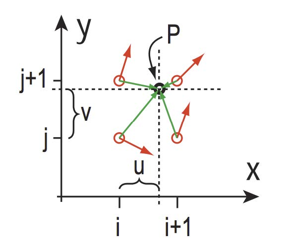



## L-system

TODO

## Wave Function Collapse


- Gridify the space. Populate it with the initial values.
- Iterate the empty cells and record the possible values that can be put in each. The number of the viable values for a grid is defined as its entropy.
- Iterate the grid with the minimum postive entropies and select one value to fill in.
- Keep looping until all entropy is non-postive.

## Noise

See also: [GLSL Noise Algorithms](https://gist.github.com/patriciogonzalezvivo/670c22f3966e662d2f83).

### Useful Fade Function

Rather than just using linear interpolation, we can use a fade function.

- [Easing functions Cheat Sheet](https://easings.net/)
- [Bias and Gain](http://demofox.org/biasgain.html)

### Useful Random Functions

- [float, small and random - 2005](https://iquilezles.org/articles/sfrand/)
- [PCG, A Family of Better Random Number Generators](https://www.pcg-random.org/#)
- [Hash Without Sine](https://www.shadertoy.com/view/4djSRW)

### [Perlin Noise](https://www.shadertoy.com/view/Md3SzB)



1. Given a point in 2D space, find its 4 surrounding lattice points.
2. Assign gradient for each lattice point with random funcion.
3. Calculate distance vector for each lattice point.
4. Calculate influence vector for each lattice point: `influence_vector = dot(gradient_vector, distance_vector)`.
5. Interpolate between all the influence vectors to get final value.

### [Worley Noise](https://www.shadertoy.com/view/MstGRl)

Also known as **Voronoi Noise**.

1. Divide the space into grids.
2. Give a point in space, find its nearest N grids and generate a random position ("cell") inside each grid.
3. Calculate the minimum distance between the sample and its surrounding cells.
4. Normalize the distance by dividing it with the longest possible distance.


### Multi-Octave Noise

Also known as **Fractional Brownian Motion (FBM)**

In practice, we can combine sevral noise with different frequency together.

Octave contributions are modulated using:
- frequency: sample rate.
- persistance: decay of amplitude as frequency increases.

```C
PerlinNoise2d(float x, float y) {
  float total = 0;
  float persisstence = 1 / 2.0f;

  for (int i = 0; i < N_OCTAVES; ++i) {
    float frequency = pow(2, i);
    float amplitude = pow(persistence, i);
    total += amplitude * sampleNoisei(x * frequency, y * frequency);
  }
  return total;
}
```

## Implicit Surface

### Approximate Normal


 is the implicit surface.

### [Signed Distance Function](https://iquilezles.org/articles/distfunctions/)

TODO

### [March Cubes](https://jamie-wong.com/2014/08/19/metaballs-and-marching-squares/)

Divide the space into uniform grids. Sample each grid corner with the implicit surface.


For example, , ,  is outside,  is inside, and ,  is on the boundary (). 


