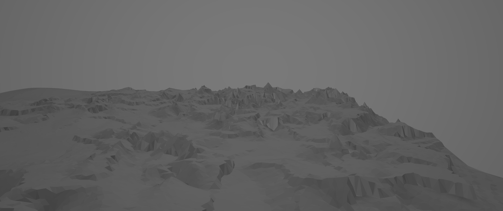
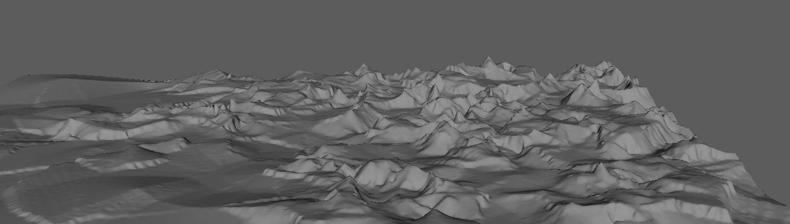



<video src="https://user-images.githubusercontent.com/28486541/280823292-7fbc4cfc-17c3-4752-a98c-fced603037b4.mp4" data-canonical-src="
https://user-images.githubusercontent.com/28486541/280823292-7fbc4cfc-17c3-4752-a98c-fced603037b4.mp4" controls="controls" autoplay = "autoplay" muted="muted" loop="loop" class="d-block rounded-bottom-2 border-top width-fit" start="10" style="width:100%"></video>

TerrainIt is an authoring tool for generating mountainous terrain mesh.

Co-author: [Shutong Wu](https://github.com/ScriptWonder)

Reference: [Orometry-based terrain analysis and synthesis](https://dl.acm.org/doi/10.1145/3355089.3356535). Argudo, O., Galin, E., Peytavie, A., Paris, A., Gain, J., & Guérin, E. ACM Transactions on Graphics (TOG), 38(6), 1-12.

## Objectives
- Generate Real World Mountainous Terrain in Maya
  - Targeted at realism which requires complex orometrydata
  - Procedurally generate real world scenery with easy GUI control
- Features Include:
  - User-Friendly GUI that allows multiple controls
  - Display divide tree and generated heightmap
  - Optimized smoothing techniques
  - Output the selected orometry in a mesh format

## Workflow

1. User selected a orometry preset. Orometry can describe various terrains on Earth.

    

2. Randomly sample peak locations while maintaining the distrubition patterns defined by the orometry data. KNN is used in this step for fast query of existing peaks.

    

3. Connect the peaks with Delaunay Triangulationton and generate ridge lines as Minium Spanning Tree of the triangulation network.

    

4. Generate the river network using the Dual Graph of the MST.

    

5. Smooth out the lines using splines. Discretize and assign height values based on the orometry data.

    

6. Use blue noise to fill out the remaining areas. The height values are interpolated.

    

7. Use Delaunay Triangulationton to generate the mesh. Import to Maya.

    

8. Use Maya's smooth tool to smooth the mesh.

    

