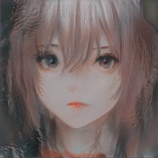

# Welcome

## About me

I am currently a Master's student at the [University of Pennsylvania](http://cg.cis.upenn.edu/). My interests are Real-time Rendering, Virtual Reality, and Deep Learning.

## Selected Projects

### [Nagi](https://github.com/IwakuraRein/Nagi)

Nagi is a toy path tracer developed in CUDA.

Artist: [NewSee2l035](https://blendswap.com/profile/35454)

### [Naku](https://github.com/IwakuraRein/Naku)

Naku is a toy rasterization-based renderer developed in Vulkan and C++.

<video src="https://user-images.githubusercontent.com/28486541/200195281-3906004f-3220-4657-b108-eec6fa4fe30d.mp4" data-canonical-src="https://user-images.githubusercontent.com/28486541/200195281-3906004f-3220-4657-b108-eec6fa4fe30d.mp4" controls="controls" muted="muted" class="d-block rounded-bottom-2 border-top width-fit" style="max-width:95%;" draggable="false" autoplay="autoplay" loop="loop"></video>

 

### CIS 565 Course Projects

<table style="width:95%">
    <tr>
        <th><a href="https://github.com/IwakuraRein/CIS-565-1-CUDA-Flocking" target="_blank">Boids Flocking Simulation with CUDA</a></th>
        <th><a href="https://github.com/IwakuraRein/CIS-565-5-Vulkan-Grass-Rendering" target="_blank">Grass Rendering with Vulkan</a></th>
    </tr>
    <tr>
        <th></th>
        <th></th>
    </tr>
    <tr>
        <th><a href="https://github.com/IwakuraRein/CIS-565-4-CUDA-Denoiser" target="_blank">Denoising Path Tracing with CUDA</a></th>
        <th><a href="https://github.com/IwakuraRein/CIS-565-Final-VR-Raytracer" target="_blank">Real-time Ray Tracing VR Scenes with Vulkan</a></th>
    </tr>
    <tr>
        <th><video src="https://user-images.githubusercontent.com/28486541/196747599-32b3307a-4af8-43af-bf47-4a27321f0234.mp4" data-canonical-src="https://user-images.githubusercontent.com/28486541/196747599-32b3307a-4af8-43af-bf47-4a27321f0234.mp4" controls="controls" muted="muted" class="d-block rounded-bottom-2 border-top width-fit" style="max-width:95%;" autoplay="autoplay" draggable="false" loop="loop"></video></th>
        <th>
            
In progress. Plan to introduce:

            <ul>
                <li><a href="https://benedikt-bitterli.me/restir/" target="_blank">ReSTIR</a></li>
                <li><a href="https://www.youtube.com/watch?v=2GYXuM10riw" target="_blank">Ridiance Cache</a></li>
                <li><a href="https://research.adobe.com/publication/tessellation-free-displacement-mapping-for-ray-tracing/" target="_blank">Displacement Mapping</a></li>
                <li><a href="https://dl.acm.org/doi/10.5555/3151666.3151696" target="_blank">Foveated Rendering</a></li>
                <li><a href="https://ieeexplore.ieee.org/document/9089460" target="_blank">Stereo Rendering</a></li>
            </ul>
        </th>
    </tr>

</table>

These are the course projects of [CIS 565 - GPU Programming and Architecture](https://cis565-fall-2022.github.io/). In this course, I will delve into GPU architecture, CUDA, and Vulkan. Its six non-trivial projects will further develop my C++ programming skills.

In the final project, we are going to implement ReSTIR(direct and indirect) with radiance cache. We also want to ray tracing on displacement map to render complex geometries. We expect to see high quality result at 90+ FPS. The renderer will be built upon [Vk Raytrace](https://github.com/nvpro-samples/vk_raytrace).

### Generating Anime Avatars

I created an anime face dataset and trained a [FastGan](https://github.com/IwakuraRein/FastGAN-pytorch) model to generate the avatar on the left. Refresh to see more.

### Teleport

<!--<video src="https://user-images.githubusercontent.com/28486541/199053796-11756267-042a-4419-823d-a4d8bf4ac0e7.mp4"></video>-->

<!---->

<video src="https://user-images.githubusercontent.com/28486541/199053796-11756267-042a-4419-823d-a4d8bf4ac0e7.mp4" data-canonical-src="https://user-images.githubusercontent.com/28486541/199053796-11756267-042a-4419-823d-a4d8bf4ac0e7.mp4" controls="controls" muted="muted" class="d-block rounded-bottom-2 border-top width-fit" style="max-width:95%;" autoplay="autoplay" draggable="false" loop="loop"></video>

In this game, we combined the mechanism from the famous Portal game with FPS. Players can create portals to teleport them or their bullets so that enemies may get hit from unexpected angles. This is the final project for the Game Design Course. 

### Dog Fight

<!--<video src="https://user-images.githubusercontent.com/28486541/199054465-aa822684-c3df-43f9-91fd-1effa06766c5.mp4"></video>-->

<!---->

<video src="https://user-images.githubusercontent.com/28486541/199054465-aa822684-c3df-43f9-91fd-1effa06766c5.mp4" data-canonical-src="https://user-images.githubusercontent.com/28486541/199054465-aa822684-c3df-43f9-91fd-1effa06766c5.mp4" controls="controls" muted="muted" class="d-block rounded-bottom-2 border-top width-fit" style="max-width:95%;" autoplay="autoplay" draggable="false" loop="loop"></video>

We made a shoot’em up game in C++ and OpenGL. Also, we used YOLO v3 to train a object detection model. The goal of using YOLO was to allow player to control character by waving hands in front of a webcam. This is the project for the Undergraduate Innovation and Entrepreneurship Training Program.

## Cheat sheets

* <a href="./docs/cheat_sheets/glsl" target="_self">GLSL</a>

* <a href="./docs/cheat_sheets/glm" target="_self">GLM</a>

* <a href="./docs/cheat_sheets/transforms" target="_self">Transformations</a>

## Free Rendering Resources

### Scenes

* [Bitterli's Rendering Resources](https://benedikt-bitterli.me/resources/)

* [McGuire Computer Graphics Archive](http://casual-effects.com/data/index.html)

* [Mitsuba Example Scenes](https://www.mitsuba-renderer.org/download.html)

* [glTF Sample Models](https://github.com/KhronosGroup/glTF-Sample-Models)

* [Poly Haven](https://polyhaven.com/)

* [CGTrader](https://www.cgtrader.com/free-3d-models)

* [Blend Swap](https://blendswap.com/)

* [Sketchfab](https://sketchfab.com)

* [TurboSquid](https://resources.turbosquid.com/)

* [Free3D](https://free3d.com)

* [Poliigon](https://www.poliigon.com)

* [Dev Assets](https://devassets.com/)

* [ORCA](https://developer.nvidia.com/orca)

### Renderers

* [PBRT](https://pbrt.org/)

* [Mitsuba](https://www.mitsuba-renderer.org)

* [Blender](https://blendjet.su/)

* [Kajiya](https://github.com/EmbarkStudios/kajiya)

* [Tungsten](https://github.com/tunabrain/tungsten)

* [Baikal](https://github.com/GPUOpen-LibrariesAndSDKs/RadeonProRender-Baikal)

* [Falcor](https://developer.nvidia.com/falcor)

* [Vk Raytrace](https://github.com/nvpro-samples/vk_raytrace)
