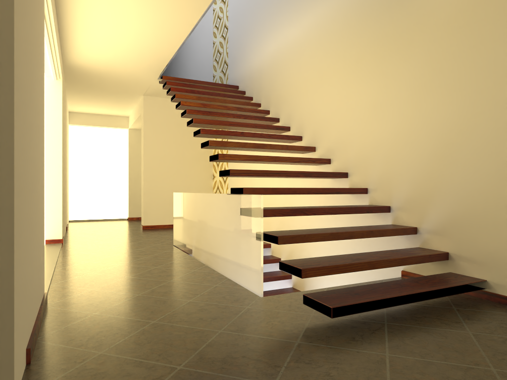
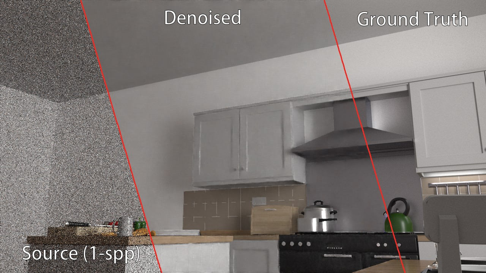
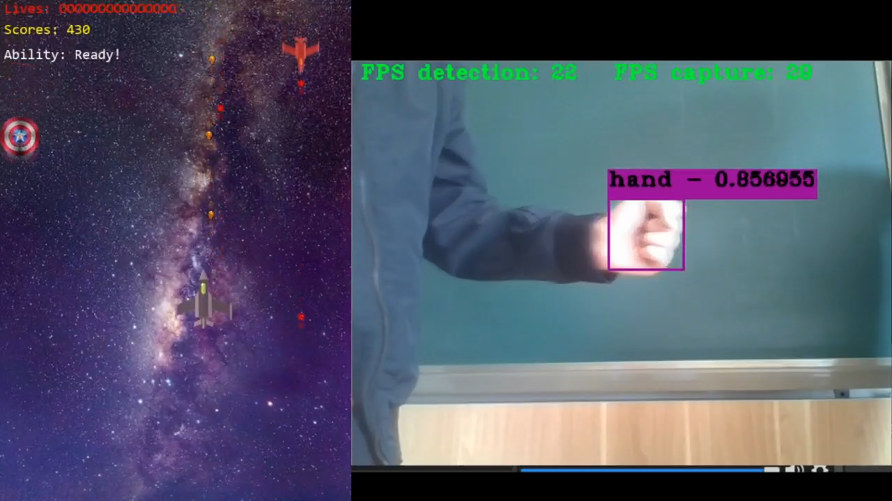

# Welcome

## About me

I am a Master's student at the [University of Pennsylvania](http://cg.cis.upenn.edu/) and currently doing an internship at [Thunder Fire Studio, Netease Game](https://leihuo.163.com/en/). My interests are Real-time Rendering, Game Development, and Deep Learning.

## Selected Projects

### Terrain Authoring Tool

TerrainIt is an authoring tool for generating mountainous terrain mesh. This is the final project of CIS 660 Advanced Topics In Computer Graphics And Animation.

Co-author: [Shutong Wu](https://github.com/ScriptWonder)

Reference: [Argudo, Oscar, et al. Orometry-based terrain analysis and synthesis.](https://dl.acm.org/doi/abs/10.1145/3355089.3356535)

<video src="./docs/projects/media/TerrainIt.mp4" data-canonical-src="./docs/projects/media/TerrainIt.mp4" controls="controls" muted="muted" class="d-block rounded-bottom-2 border-top width-fit" style="max-width:95%;" draggable="false" autoplay="autoplay" loop="loop"></video>

 

### [Cuda Path Tracer](https://github.com/IwakuraRein/Nagi)

Nagi is a toy path tracer developed in CUDA.

Artist: [NewSee2l035](https://blendswap.com/profile/35454)

### [Vulkan Realtime Ray Tracer](https://github.com/IwakuraRein/CIS-565-Final-VR-Raytracer)

Eidola is a **real-time** ray tracer based on Vulkan's ray tracing api and the ReSTIR algorithm. This is the final project for [CIS 565 - GPU Programming and Architecture](https://cis565-fall-2022.github.io/).

### Path Tracing Denoising

A multi-scale convolutional neural network enhanced with a separate encoder of G-buffers. It effectively denoises extremely noisy Monte-Carlo rendering and can achieve near real-time speeds.

### CIS 565 Course Projects

<table style="width:95%">
    <tr>
        <th><a href="https://github.com/IwakuraRein/CIS-565-1-CUDA-Flocking" target="_blank">Boids Flocking Simulation with CUDA</a></th>
        <th><a href="https://github.com/IwakuraRein/CIS-565-5-Vulkan-Grass-Rendering" target="_blank">Grass Rendering with Vulkan</a></th>
    </tr>
    <tr>
        <th></th>
        <th></th>
    </tr>
    <tr>
        <th><a href="https://github.com/IwakuraRein/CIS-565-4-CUDA-Denoiser" target="_blank">Denoising Path Tracing with CUDA</a></th>
        <th><a href="https://github.com/IwakuraRein/CIS-565-Final-VR-Raytracer" target="_blank">Real-time Ray Tracing with Vulkan</a></th>
    </tr>
    <tr>
        <th><video src="https://user-images.githubusercontent.com/28486541/196747599-32b3307a-4af8-43af-bf47-4a27321f0234.mp4" data-canonical-src="https://user-images.githubusercontent.com/28486541/196747599-32b3307a-4af8-43af-bf47-4a27321f0234.mp4" controls="controls" muted="muted" class="d-block rounded-bottom-2 border-top width-fit" style="max-width:95%;" autoplay="autoplay" draggable="false" loop="loop"></video></th>
        <th>
            
        </th>
    </tr>

</table>

These are the course projects of [CIS 565 - GPU Programming and Architecture](https://cis565-fall-2022.github.io/). In this course I delved into GPU architecture, CUDA, and Vulkan. Its six non-trivial projects will further develop my C++ programming skills.

### Generating Anime-style Avatars

I created an anime-style face dataset and trained a [FastGan](https://github.com/IwakuraRein/FastGAN-pytorch) model to generate the avater above. Click to see more.

### [Vulkan Realtime Renderer](https://github.com/IwakuraRein/Naku)

Naku is a toy rasterization-based renderer developed in Vulkan and C++.

<video src="https://user-images.githubusercontent.com/28486541/202858685-5ffbc4ae-d736-40f6-94bf-79cdf4304e90.mp4" data-canonical-src="https://user-images.githubusercontent.com/28486541/202858685-5ffbc4ae-d736-40f6-94bf-79cdf4304e90.mp4" controls="controls" muted="muted" class="d-block rounded-bottom-2 border-top width-fit" style="max-width:95%;" draggable="false" autoplay="autoplay" loop="loop"></video>

 

### Hand Tracking Game

<!--<video src="https://user-images.githubusercontent.com/28486541/199054465-aa822684-c3df-43f9-91fd-1effa06766c5.mp4"></video>-->

<!---->

<video src="https://user-images.githubusercontent.com/28486541/202858435-678eabce-0ccc-4f2e-b41d-faad4025cde4.mp4" data-canonical-src="https://user-images.githubusercontent.com/28486541/202858435-678eabce-0ccc-4f2e-b41d-faad4025cde4.mp4" controls="controls" muted="muted" class="d-block rounded-bottom-2 border-top width-fit" style="max-width:95%;" autoplay="autoplay" draggable="false" loop="loop"></video>

We made a shoot’em up game in C++ and OpenGL. Also, we used YOLO v3 to train a object detection model. The goal of using YOLO was to allow player to control character by waving hands in front of a webcam. This is the project for the Undergraduate Innovation and Entrepreneurship Training Program.

## Cheat sheets

* <a href="./docs/cheat_sheets/glsl" target="_self">GLSL</a>

* <a href="./docs/cheat_sheets/glm" target="_self">GLM</a>

* <a href="./docs/cheat_sheets/transforms" target="_self">Transformations</a>

## Game Development Resources

Click <a href="./docs/game_development_resources" target="_self">here</a> to see a lot of useful resources for game development.

## Free Rendering Resources

### Scenes

* [Bitterli's Rendering Resources](https://benedikt-bitterli.me/resources/)

* [McGuire Computer Graphics Archive](http://casual-effects.com/data/index.html)

* [Mitsuba Example Scenes](https://www.mitsuba-renderer.org/download.html)

* [glTF Sample Models](https://github.com/KhronosGroup/glTF-Sample-Models)

* [Poly Haven](https://polyhaven.com/)

* [CGTrader](https://www.cgtrader.com/free-3d-models)

* [Blend Swap](https://blendswap.com/)

* [Sketchfab](https://sketchfab.com)

* [TurboSquid](https://resources.turbosquid.com/)

* [Free3D](https://free3d.com)

* [Poliigon](https://www.poliigon.com)

* [Dev Assets](https://devassets.com/)

* [ORCA](https://developer.nvidia.com/orca)

### Renderers

* [PBRT](https://pbrt.org/)

* [Mitsuba](https://www.mitsuba-renderer.org)

* [Blender](https://blendjet.su/)

* [Kajiya](https://github.com/EmbarkStudios/kajiya)

* [Tungsten](https://github.com/tunabrain/tungsten)

* [OSPRay](https://github.com/ospray/OSPRay)

* [Baikal](https://github.com/GPUOpen-LibrariesAndSDKs/RadeonProRender-Baikal)

* [ChameleonRT](https://github.com/Twinklebear/ChameleonRT)

* [Falcor](https://developer.nvidia.com/falcor)

* [Vk Raytrace](https://github.com/nvpro-samples/vk_raytrace)

