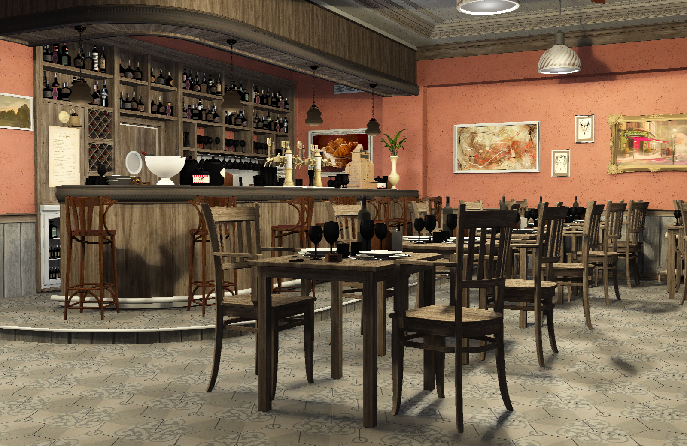

<h1 id="about-me" align="center"> About Me </h1>

I did an internship at <a href="https://leihuo.163.com/en/">Thunder Fire Studio, Netease Game</a>, with a focus on Unity development.

I'm a Master's student at the <a href="http://cg.cis.upenn.edu/">University of Pennsylvania</a> with a passion for real-time rendering, game development, and deep learning. During my intern at <a href="https://leihuo.163.com/en/">Thunder Fire Studio, Netease Game</a>, I participated in the Project Mugen with a focus on Unity development.

<h1 id="portfolio" align="center"> Portfolio </h1>

    <ul>
        <li id="projectBtn1" onclick="toggleProject(1)" class="highlighted">(Technical) Art</li>
        <li id="projectBtn2" onclick="toggleProject(2)">Computer Graphics</li>
        <li id="projectBtn4" onclick="toggleProject(4)">Games</li>
        <li id="projectBtn3" onclick="toggleProject(3)">Machine Learning</li>
    </ul>

<h2>Maya Terrain Authoring Tool</h2>

<video src="https://IwakuraRein.github.io/docs/projects/media/TerrainIt.mp4" data-canonical-src="https://IwakuraRein.github.io/docs/projects/media/TerrainIt.mp4" controls="controls" autoplay = "autoplay" muted="muted" loop="loop" class="d-block rounded-bottom-2 border-top width-fit" start="10" style="width:100%"></video>

TerrainIt is an authoring tool for generating mountainous terrain mesh.

Co-author: <a href="https://github.com/ScriptWonder">Shutong Wu</a>

Reference: <a href="https://dl.acm.org/doi/abs/10.1145/3355089.3356535">Argudo, Oscar, et al. Orometry-based terrain analysis and synthesis</a>

<h2> Lego-ify with Houdini </h2>
<!--  -->
<video src="https://user-images.githubusercontent.com/28486541/277182818-c432c0e5-7fb5-4202-8e47-14e854db5954.mp4" data-canonical-src="https://user-images.githubusercontent.com/28486541/277182818-c432c0e5-7fb5-4202-8e47-14e854db5954.mp4"  autoplay = "autoplay" muted="muted" loop="loop" class="d-block rounded-bottom-2 border-top width-fit" style="width:100%"></video>

<h2>Jellyfish with Houdini</h2>

<!-- 

 -->

  

<h2>Kitchen with Maya</h2>

<!-- 

 -->

  

<h2><a href="https://github.com/IwakuraRein/Nagi">Cuda Path Tracer</a></h2>

A toy path tracer developed in CUDA.

Artist: <a href="https://blendswap.com/profile/35454">NewSee2l035</a>

<h2><a href="https://github.com/IwakuraRein/CIS-565-Final-VR-Raytracer">Vulkan Realtime Ray Tracer</a></h2>

A <b>real-time</b> ray tracer based on Vulkan's ray tracing api and the ReSTIR algorithm. This is the final project for <a href="https://cis565-fall-2022.github.io/">CIS 565 - GPU Programming and Architecture</a>.

  

<h2>CIS 565 Course Projects</h2>

<table style="width:95%">
    <tr>
        <th><a href="https://github.com/IwakuraRein/CIS-565-1-CUDA-Flocking" target="_blank">Boids Flocking Simulation with CUDA</a></th>
        <th><a href="https://github.com/IwakuraRein/CIS-565-5-Vulkan-Grass-Rendering" target="_blank">Grass Rendering with Vulkan</a></th>
    </tr>
    <tr>
        <th></th>
        <th></th>
    </tr>
    <tr>
        <th><a href="https://github.com/IwakuraRein/CIS-565-4-CUDA-Denoiser" target="_blank">Denoising Path Tracing with CUDA</a></th>
        <th><a href="https://github.com/IwakuraRein/CIS-565-Final-VR-Raytracer" target="_blank">Real-time Ray Tracing with Vulkan</a></th>
    </tr>
    <tr>
        <th><video src="https://user-images.githubusercontent.com/28486541/196747599-32b3307a-4af8-43af-bf47-4a27321f0234.mp4" data-canonical-src="https://user-images.githubusercontent.com/28486541/196747599-32b3307a-4af8-43af-bf47-4a27321f0234.mp4" controls="controls" muted="muted" class="d-block rounded-bottom-2 border-top width-fit" style="max-width:90%;" autoplay="autoplay" draggable="false" loop="loop"></video></th>
        <th>
            
        </th>
    </tr>

</table>

These are the course projects of <a href="https://cis565-fall-2022.github.io/">CIS 565 - GPU Programming and Architecture</a>. In this course I delved into GPU architecture, CUDA, and Vulkan. Its six non-trivial projects will further develop my C++ programming skills.

<!-- <h2>CIS 566 Procedual Computer Graphics Projects</h2>

<table style="width:95%">
    <tr>
        <th><a href="https://thecger.com/CIS-566-hw01-fireball/" target="_blank">Procedual Fire Ball</a></th>
        <th>Houdini Jellyfish</th>
    </tr>
    <tr>
        <th></th>
        <th></th>
    </tr>

</table> -->

<h2><a href="https://github.com/IwakuraRein/Naku">Vulkan Realtime Renderer</a></h2>

Naku is a toy rasterization-based renderer developed in Vulkan and C++.

<video src="https://user-images.githubusercontent.com/28486541/202858685-5ffbc4ae-d736-40f6-94bf-79cdf4304e90.mp4" data-canonical-src="https://user-images.githubusercontent.com/28486541/202858685-5ffbc4ae-d736-40f6-94bf-79cdf4304e90.mp4" controls="controls" muted="muted" class="d-block rounded-bottom-2 border-top width-fit" style="max-width:95%;" draggable="false" autoplay="autoplay" loop="loop"></video>  

<h2><a href="https://dw218192.itch.io/mingle">Mingle</a></h2>

A platform game demo developed with Unity in the CIGA Game Jam 2023 within 48 hours.

<h2>Teleport</h2>

A FPS demo allowing players to place portals and fire bullets through them.

<h2>Hand Tracking Game</h2>

<!--<video src="https://user-images.githubusercontent.com/28486541/199054465-aa822684-c3df-43f9-91fd-1effa06766c5.mp4"></video>-->

<!---->

<video src="https://user-images.githubusercontent.com/28486541/202858435-678eabce-0ccc-4f2e-b41d-faad4025cde4.mp4" data-canonical-src="https://user-images.githubusercontent.com/28486541/202858435-678eabce-0ccc-4f2e-b41d-faad4025cde4.mp4" controls="controls" muted="muted" class="d-block rounded-bottom-2 border-top width-fit" style="max-width:95%;" autoplay="autoplay" draggable="false" loop="loop"></video>

Made a shoot’em up game in C++ and OpenGL. Also, we used YOLO v3 to train a object detection model. The goal of using YOLO was to allow player to control character by waving hands in front of a webcam. This is the project for the Undergraduate Innovation and Entrepreneurship Training Program.

<h2>Path Tracing Denoising</h2>

A multi-scale convolutional neural network enhanced with a separate encoder of G-buffers. It effectively denoises extremely noisy Monte-Carlo rendering and can achieve near real-time speeds.

<b>Publications</b>:

<ul>
    <li>
        <a href="https://dl.acm.org/doi/10.1145/3476124.3488631" target = "_blank"><b>Monte Carlo Denoising with a Sparse Auxiliary Feature Encoder</b></a>
         
        SIGGRAPH Asia ’21 Posters
    </li>
    <li>
        <a href="https://link.springer.com/article/10.1007/s00371-021-02204-4" target = "_blank"><b>Denoising Monte Carlo renderings via a multi-scale featured dual-residual GAN</b></a>
         
        The Visual Computer 2021
    </li>
</ul>

<h2>Generating Anime-style Avatars</h2>

I created an anime-style face dataset and trained a <a href="https://github.com/IwakuraRein/FastGAN-pytorch">FastGan</a> model to generate the avater above. Click to see more.

