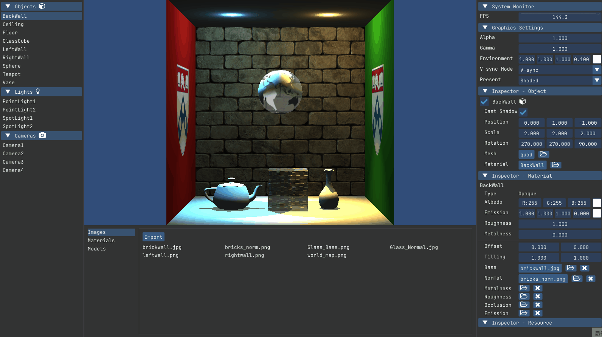
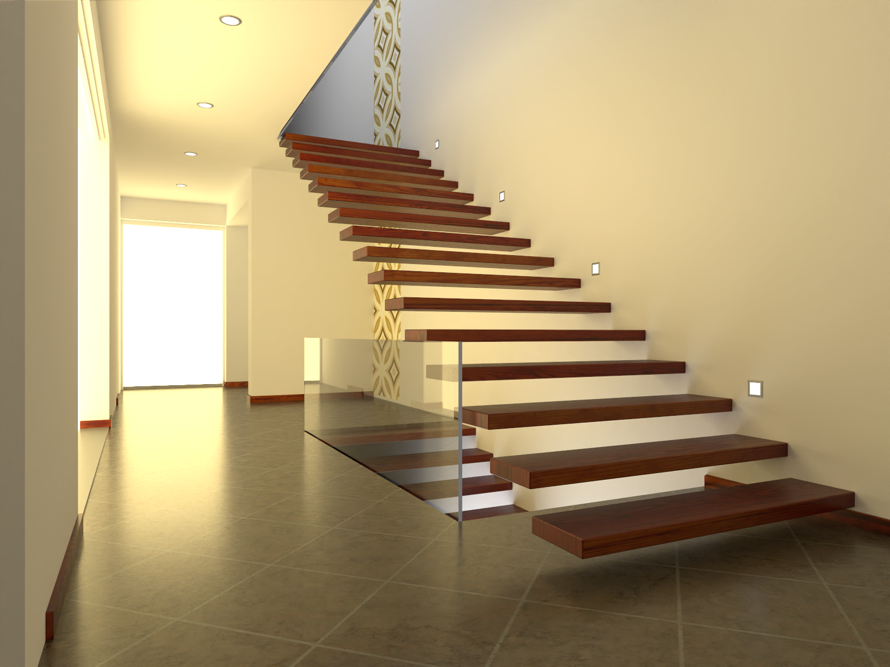

# Welcome

## About me

I am currently a Master student at [University of Pennsylvania](http://cg.cis.upenn.edu/). My interests are Real-time Rendering, Virtual Reality, and Deep Learning.

## Selected Projects

### Naku

Naku is a toy rasterization-based renderer developed in Vulkan and C++.

### [Nagi](https://github.com/IwakuraRein/Nagi)

Nagi is a toy path tracer developed in CUDA.

Artist: [NewSee2l035](https://blendswap.com/profile/35454) 

### CIS 565 Course Projects

<table style="width:95%">
    <tr>
        <th>Boids Flocking Simulation with CUDA</th>
        <th>Grass Rendering with Vulkan</th>
    </tr>
    <tr>
        <th></th>
        <th></th>
    </tr>
</table>

These are the course projects of <a href="https://cis565-fall-2022.github.io/" target="_blank">CIS 565 - GPU Programming and Architecture</a>. In this course, I will delve into GPU architecture and learn about CUDA, WebGL, and Vulkan. Its six non-trivial projects will further develop my C++ programming skills.

### <a href="https://github.com/IwakuraRein/Teleport_FPS_Game" target="_blank">Teleport</a>

<!--<video src="https://user-images.githubusercontent.com/28486541/199053796-11756267-042a-4419-823d-a4d8bf4ac0e7.mp4"></video>-->
<!---->
<video src="https://user-images.githubusercontent.com/28486541/199053796-11756267-042a-4419-823d-a4d8bf4ac0e7.mp4" data-canonical-src="https://user-images.githubusercontent.com/28486541/199053796-11756267-042a-4419-823d-a4d8bf4ac0e7.mp4" controls="controls" muted="muted" class="d-block rounded-bottom-2 border-top width-fit" style="max-width:95%;"></video>

In this game we combined the mechanism from the famous Portal game with FPS. Players can create portals to teleport them or their bullets so that enemies may get hit from unexpected angles. This is the final project for the Game Design Course. 

### Dog Fight

<!--<video src="https://user-images.githubusercontent.com/28486541/199054465-aa822684-c3df-43f9-91fd-1effa06766c5.mp4"></video>-->
<!---->
<video src="https://user-images.githubusercontent.com/28486541/199054465-aa822684-c3df-43f9-91fd-1effa06766c5.mp4" data-canonical-src="https://user-images.githubusercontent.com/28486541/199054465-aa822684-c3df-43f9-91fd-1effa06766c5.mp4" controls="controls" muted="muted" class="d-block rounded-bottom-2 border-top width-fit" style="max-width:95%;"></video>

We made a shoot’em up game in C++ and OpenGL. Also, we used YOLO v3 to train a object detection model. The goal of using YOLO was to allow player to control character by waving hands in front of a webcam. This is the project for the Undergraduate Innovation and Entrepreneurship Training Program.

## Cheat sheets

* [GLSL](./docs/cheat_sheets/glsl)

* [GLM](./docs/cheat_sheets/glm)

* [Transformations](./docs/cheat_sheets/transforms)

## Free Rendering Resources

### Scenes

* [Bitterli's Rendering Resources](https://benedikt-bitterli.me/resources/)

* [McGuire Computer Graphics Archive](http://casual-effects.com/data/index.html)

* [Mitsuba Example Scenes](https://www.mitsuba-renderer.org/download.html)

* [glTF Sample Models](https://github.com/KhronosGroup/glTF-Sample-Models)

* [Poly Haven](https://polyhaven.com/)

* [CGTrader](https://www.cgtrader.com/free-3d-models)

* [Blend Swap](https://blendswap.com/)

* [Sketchfab](https://sketchfab.com)

* [TurboSquid](https://resources.turbosquid.com/)

* [Free3D](https://free3d.com)

* [Dev Assets](https://devassets.com/)

* [ORCA](https://developer.nvidia.com/orca)

### Renderers

* [PBRT](https://pbrt.org/)

* [Mitsuba](https://www.mitsuba-renderer.org)

* [Blender](https://blendjet.su/)

* [Tungsten](https://github.com/tunabrain/tungsten)

* [Baikal](https://github.com/GPUOpen-LibrariesAndSDKs/RadeonProRender-Baikal)

* [Falcor](https://developer.nvidia.com/falcor)
